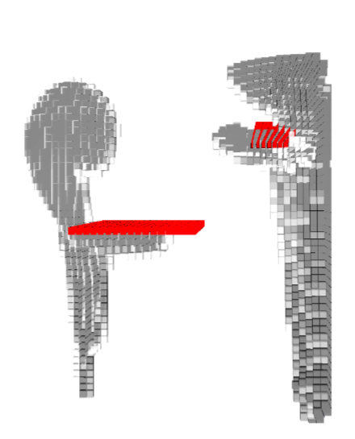

# Symulacja systemów dyskretnych - Smoke dynamics 3D​

## Autorzy:
- Michał Burda - michaburda@student.agh.edu.pl​
- Radosław Barszczak - rbarszczak@student.agh.edu.pl​
- Paweł Froń - pawelfron@student.agh.edu.pl

## Opis projektu:
Projekt trójwymiarowego modelu rozprzestrzeniania się dymu w pomieszczeniu, z uwzględnieniem kierunku ruchu powietrza i przeszkód.​
W ramach projektu sporządziliśmy model formalny oraz zaimplementujemy symulację 3D.

## Wygląd naszej symulacji

## Jak uruchomić?
Aby uruchomić symulację należy wykonać w terminalu nastepujace komendy:

Pobranie projektu:  
git clone https://github.com/MichalBurda4/Discrete-system-simulation.git

Przejscie do głównego katalogu projektu:  
cd Discrete-system-simulation

Odpalenie symulacji:  
mvn javafx:run
